# Motion Mind Fitness Journey or MMFJ !

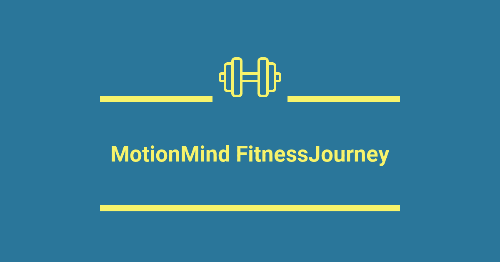

The idea was to have a website usefull for people who mainly do crossfit but accessible to people who also do general sportsand wants to improve their mobility. There is no need of a certain level of fitness to use it.
I wanted to make it easier and more accessible mobility routine: mobility is very important for an elite athlete yesbut also for anyone. How much time do we pass sit down in a day?! Moving our muscles is very important to be able to stay healthy even  at 90 years old. 
The hardest part is to start and found a routine to do, here come MMFJ to help you!

## Breakdown of the App

### Navbar

There is 2 differents navbar set up depending if you are login or not. The first one when you are not login give you access to post-workout pages, pre-workout pages, sign up page, login page and the logo on the left will lead you back to homepage. 
Now when the user login, he will have access to more things: general mobility appear, the user name appear(leads to the user page) and log out appear. We don't have sign up or login.

### Homepage

There is 3 sections of the homepage.

The here section 

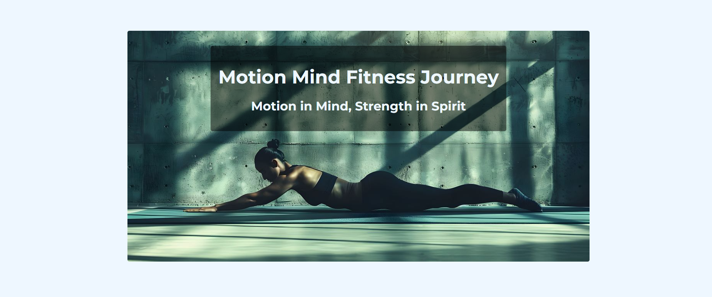

The about section

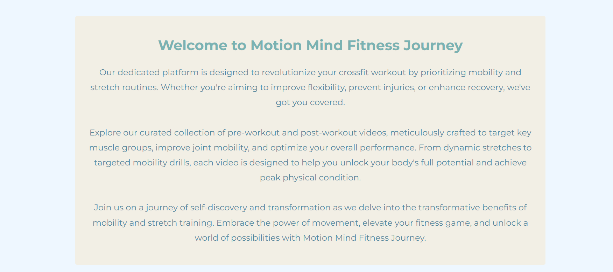

And the features section 

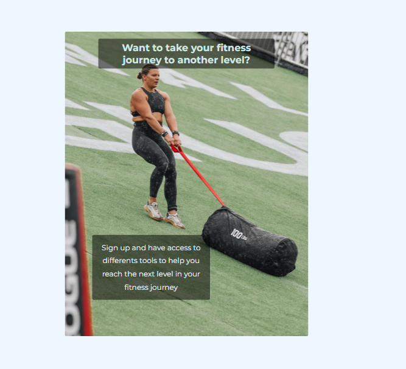

### Sign up 

For the sign up page we have a form. I do ask the country and the city. The idea will be in the future to use this information, maybe display the users pages like a 'facebook' and be able to interact with other crossfitters and meet in your city. The button will be disable until all info are field. We message will appear to let you know once your account has been created or if there is any errors. All info are store in the DB, the password for security reason is hash.

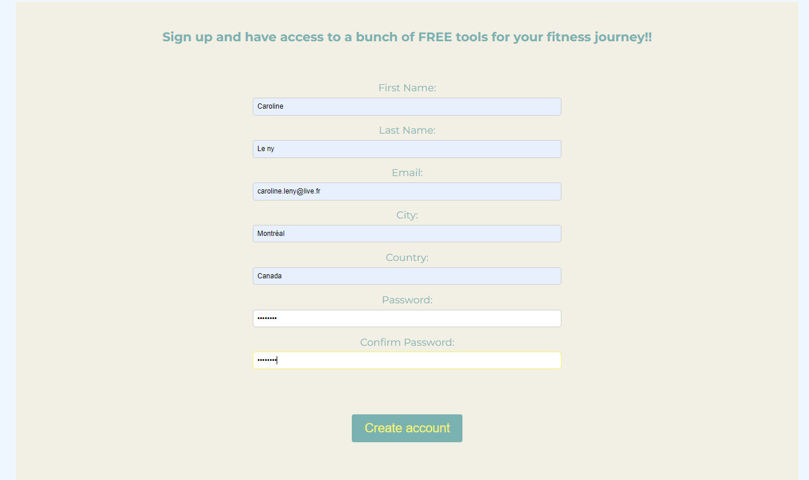

### Login

For the login the user only need his email and password. The button will be disable until all info are field. We message will appear to let you know that the process to retrieve your info is happening. Once you are login, the website will navigate to your user page automatically and the navbar set up will change.

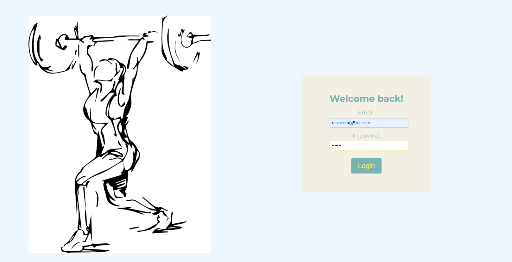

### User page

In the user page there is 3 sections: 

The first one is an intro for the user

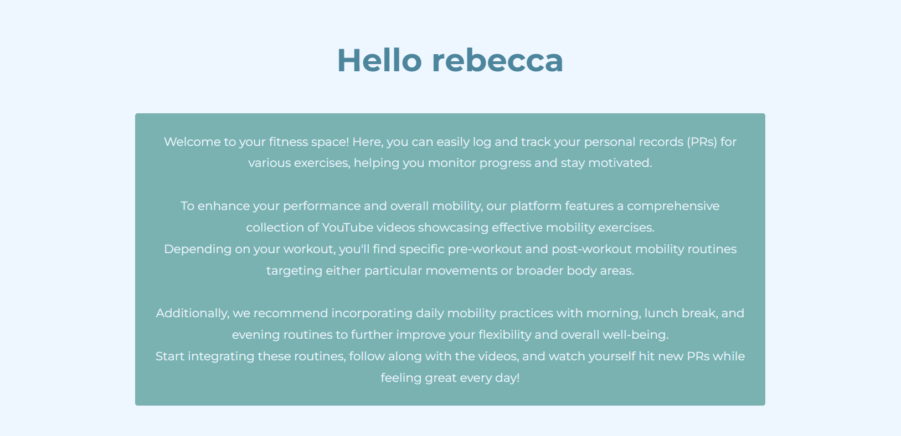

Then there is a section with all your current PRs(Personal Records) in different exercises. This is very important to know what is your PR to be able to adjust the weight of some workouts.

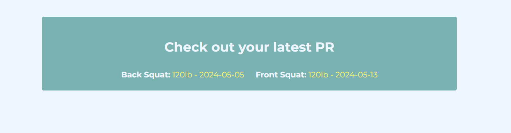

Last section is to update your PRs. You can choose the exercise, put the weight in lb and choose a date. A message will let you know once your PR has been send to the DB and your current PR section will update automatically. 

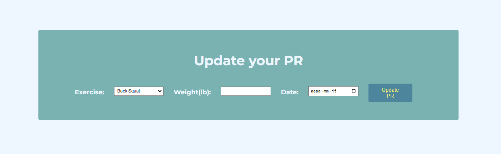

### Pre-Workout

We have the homepage that let you choose if you want to focus by body area or movements.

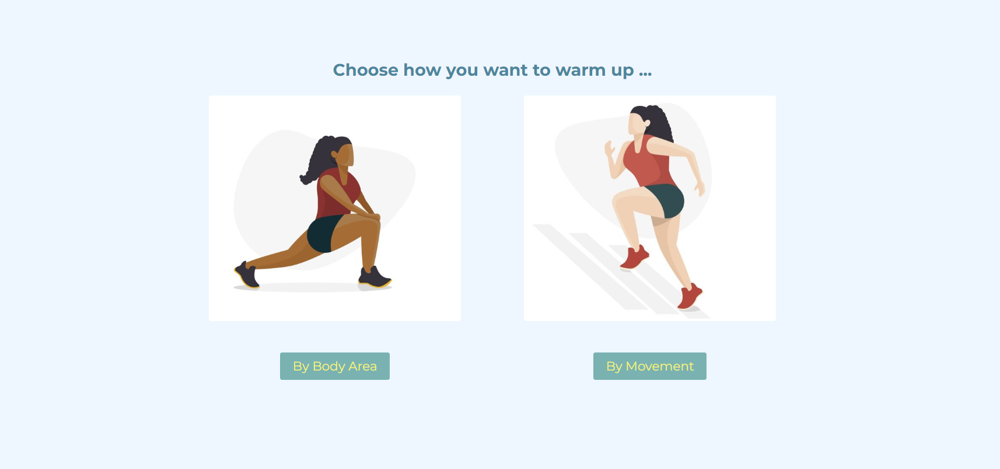

If you choose body area it leads you to a page with youtube video for some mobility routine. You can also filter the video to only see the ones that you are interested in. 

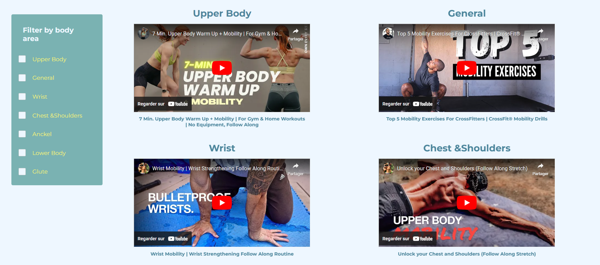

If you choose movement it leads you to a page with youtube video for some mobility routine. You can also filter the video to only see the ones that you are interested in. 

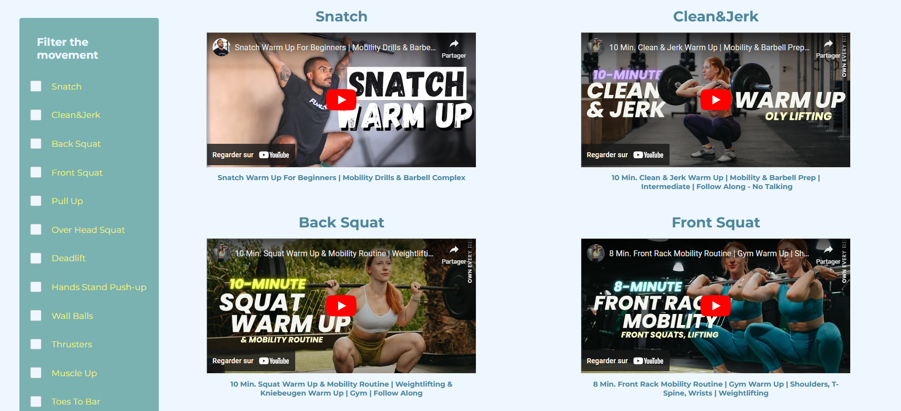

### Post-Workout

We have the homepage that let you choose if you want to focus by body area or movements.

If you choose body area it leads you to a page with youtube video for some mobility routine. You can also filter the video to only see the ones that you are interested in. 

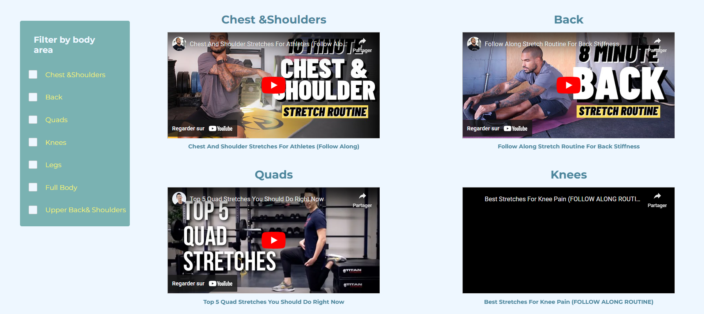

If you choose movement it leads you to a page with youtube video for some mobility routine. You can also filter the video to only see the ones that you are interested in. 

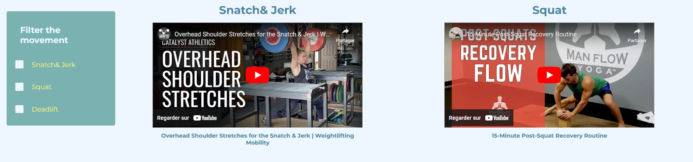

### General-Mobility

We have the homepage that let you choose if you want to do morning or night routine.

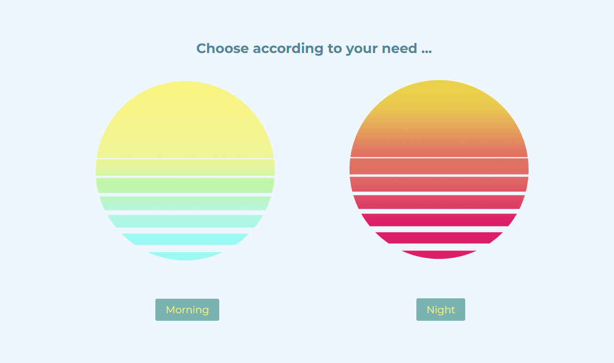

If you choose morning it leads you to a page with 3 youtube video for some mobility routine, depending of how much time you have.

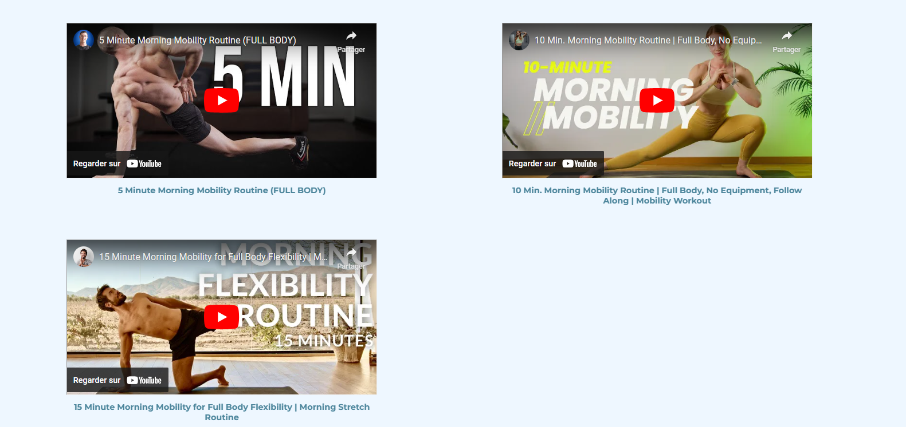

If you choose night it leads you to a page with 3 youtube video for some mobility routine, depending of how much time you have.

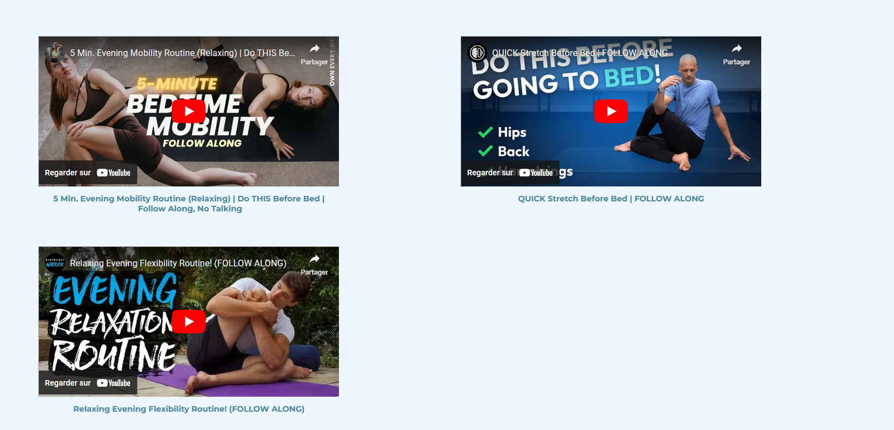

### Footer

For the footer we can found the name of the owner and also click on the terms that will lead you to page with all legal informations.

I hope you enjoy your visit on MMJF, and that it's only the beginning of your mobility journey!!!

## For the coding part 

My main goal was to have a clean, organize and DRY code as possible. To use as much tools that i learned during the course. 
I did pass a lot of time on the responsivness of the website. I wanted to learn from the experience from the portfolio and be able to have fun with css.
For the API  used, i wish to could have used it more but for the purpose of the website i didn't needed to display more information than the video title.

There is a few more things i would like to work on. Like adding a section in the user page to display charts and see the improvement made in time on each exercises. And add also a goals list that will be store in the db. And i am sure i will found more things to add or try out with this website.